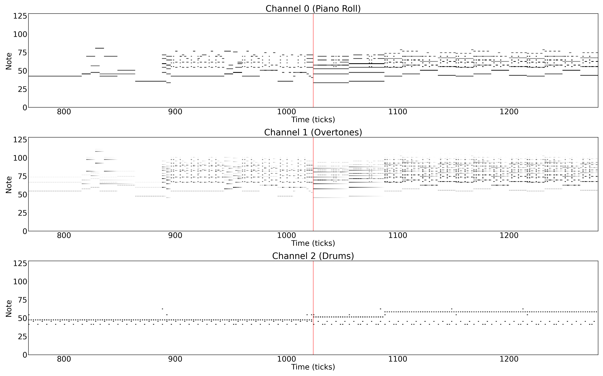

# Barwise Section Boundary Detection in Symbolic Music Using CNNs



This repository contains accompanying code for the ISMIR 2025 paper "Barwise Section Boundary Detection in Symbolic Music Using Convolutional Neural Networks".
Models were trained and evaluated on the [SLMS dataset](https://github.com/m-malandro/SLMS).

## Notebooks
- `training.ipynb`: This notebook handles data preparation and training. It can be executed from top to bottom to train a MIDI section boundary detection model on the SLMS dataset. It only expects the full [LMD dataset](https://colinraffel.com/projects/lmd/#get) containing original MIDI files to be downloaded and extracted in `data/lmd_full`, as well as the SLMS metadata json files to be in the `data` directory.
- `evaluation.ipynb`: This notebook evaluates the trained model on the SLMS dataset. It expects the four models to ensemble (see paper) to be in the `models/` directory and the SLMS metadata json files to be in the `data` directory. Evaluating different models can be done by changing the `model_paths` variable in the notebook.

## Custom Training

To run with a custom training configuration, adapt the configs in the first cell of the training notebook or use the `train.py` script. It supports a wide range of configurable options for model architecture, training strategy, and data handling. Below are the available command-line arguments:

- `--pretrained`:
  Whether to load pre-trained MobileNetV3 weights.

- `--window-half-ticks`:
  Sets the half-width of each patch in MIDI ticks. Each input patch will cover `2 * window_half_ticks`.

- `--instrument-overtones`:
  If set, uses an overtone-based encoding for instruments.

- `--separate-drums`:
  Use a dedicated channel or representation for drum instruments.

- `--drop-boundary-patches`: 
  Drops patches around boundaries that do not span a full window. This avoids padding (see paper).

- `--num-targets`:
  Each training target i asks the network to predict whether there is a boundary within 2**(i-1) bars of center. For the default configuration of 1, this means the model predicts whether there is a boundary at exactly the center of the patch. If set to 2, it will additionally predict whether there is a boundary within 1 bar before or after the center, and so on.

- `--batch-size`:
  Batch size for training and validation steps.

- `--num-epochs`:
  Maximum number of training epochs.

- `--positive-oversampling-factor`:
  Multiplier to oversample positive (boundary) patches in each epoch.

- `--negative-undersampling-factor`:
  Multiplier to reduce sampling of negative (non-boundary) patches.

- `--lr`:
  Learning rate for the optimizer.

- `--weight-decay`:
  L2 regularization coefficient.

- `--data-dir`:
  Path to a directory containing the preprocessed patches (output of `create_lakh_dataset` in `data/utils.py`).

- `--model-dir`:
  Directory where model checkpoints will be saved or resumed from.

- `--log-dir`:
  Directory for writing TensorBoard logs.

- `--resume`:
  If provided, training will resume from the latest checkpoint in `--model-dir`.

- `--device`:
  Manually specify training device (`cuda`, `cpu`, etc). If not provided, device will be auto-detected.

### Example Usage
python train.py \\\
    --pretrained \\\
    --data-dir data/lakh_data_256_overtones_True_separate_drums_True \\\
    --instrument-overtones \\\
    --patch-normalize \\\
    --positive-oversampling-factor 2 \\\
    --model-dir models/ \\\
    --device mps
```